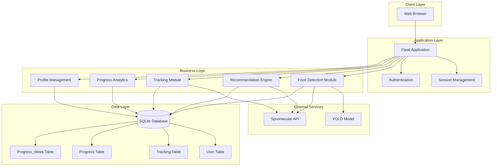
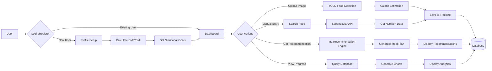
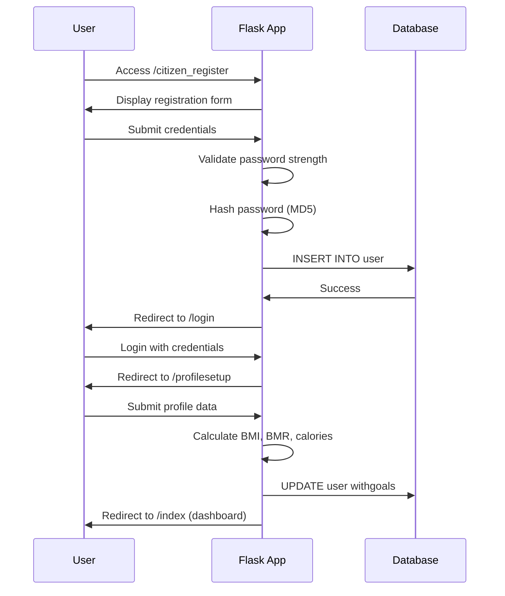
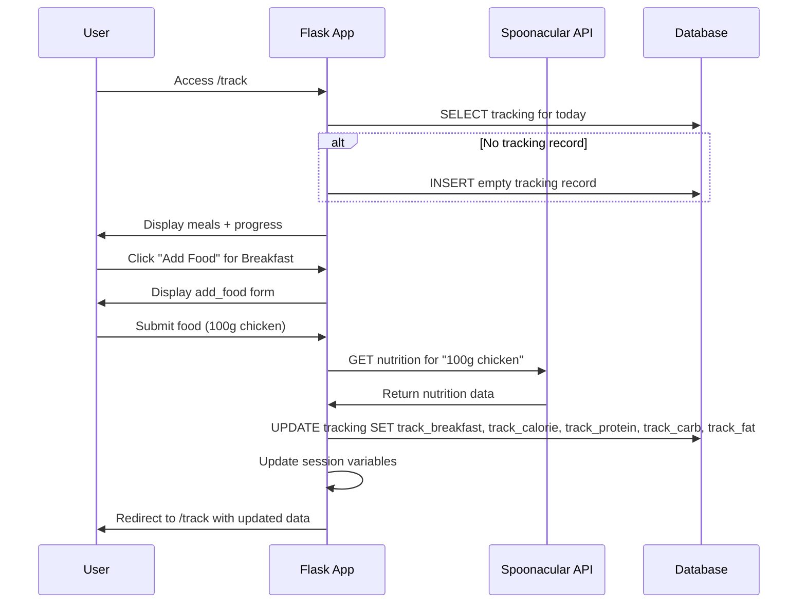
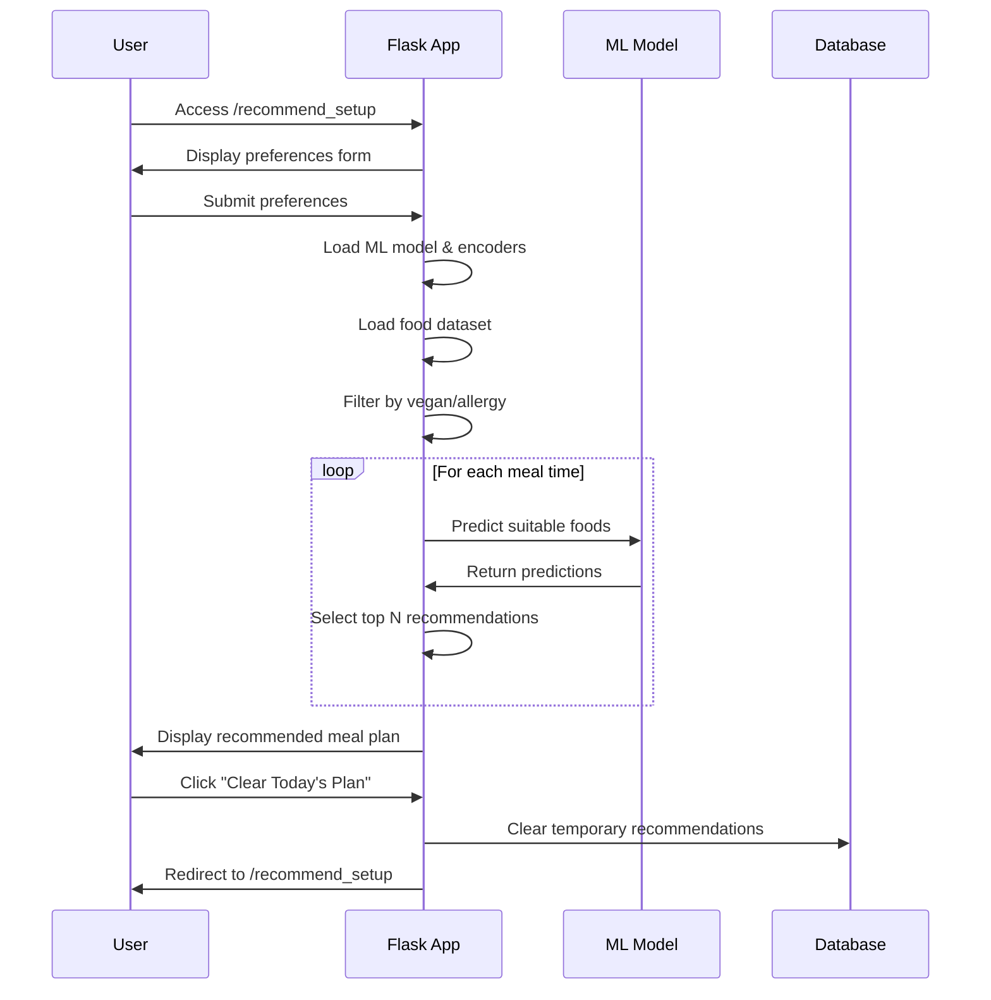

# SmartDiet AI - System Documentation

## Table of Contents
1. [System Overview](#system-overview)
2. [System Architecture](#system-architecture)
3. [Database Schema](#database-schema)
4. [Key Features](#key-features)
5. [API Integrations](#api-integrations) 6. [Code Structure](#code-structure)
7. [User Flows](#user-flows)
8. [Machine Learning Components](#machine-learning-components)

---

## System Overview

**SmartDiet AI** is a comprehensive diet and nutrition tracking application that combines:
- AI-powered food detection using YOLO (You Only Look Once) object detection
- Personalized diet recommendations using machine learning
- Calorie and macro nutrient tracking
- Progress monitoring and analytics
- Integration with Spoonacular API for nutritional data

### Technology Stack
- **Backend:** Flask (Python)
- **Database:** SQLite3
- **ML/AI:** 
  - YOLO v8 (Food Detection)
  - XGBoost/Decision Tree (Diet Recommendation)
  - scikit-learn (Preprocessing, metrics)
- **APIs:** Spoonacular, Nutritionix
- **Frontend:** HTML, CSS, JavaScript, Bootstrap
- **Image Processing:** OpenCV, NumPy

---

## System Architecture



### Data Flow Diagram



---

## Database Schema

### 1. User Table
```sql
CREATE TABLE user (
    u_id INTEGER PRIMARY KEY AUTOINCREMENT,
    u_username TEXT,
    u_password TEXT,  -- MD5 hashed
    u_gender TEXT,
    u_age INTEGER,
    u_email TEXT,
    u_weight INTEGER,  -- kg
    u_feet INTEGER,
    u_inches INTEGER,
    u_bmi REAL,
    u_activitylevel TEXT,
    u_vegan TEXT,
    u_allergy TEXT,
    u_protein INTEGER,  -- Daily goal (g)
    u_carb INTEGER,     -- Daily goal (g)
    u_fat INTEGER,      -- Daily goal (g)
    u_calories INTEGER, -- Daily goal (kcal)
    u_bodyfat INTEGER,
    u_status TEXT,      -- underweight/healthy weight/overweight/obese
    u_fiber INTEGER,
    u_journey INTEGER,  -- Day count since start
    u_startdate TEXT    -- YYYY-MM-DD
);
```

### 2. Tracking Table
```sql
CREATE TABLE tracking (
    t_id INTEGER PRIMARY KEY AUTOINCREMENT,
    track_date TEXT,    -- YYYY-MM-DD
    u_id INTEGER,
    track_breakfast TEXT,  -- Comma-separated food names
    track_lunch TEXT,
    track_snack TEXT,
    track_dinner TEXT,
    track_calorie REAL,
    track_protein REAL,
    track_carb REAL,
    track_fat REAL,
    FOREIGN KEY(u_id) REFERENCES user(u_id)
);
```

### 3. Progress Table
```sql
CREATE TABLE progress (
    p_id INTEGER PRIMARY KEY AUTOINCREMENT,
    u_id INTEGER,
    p_date TEXT,        -- YYYY-MM-DD
    p_weight INTEGER,   -- kg
    FOREIGN KEY(u_id) REFERENCES user(u_id)
);
```

### 4. Progress_Week Table
```sql
CREATE TABLE progress_week (
    pw_id INTEGER PRIMARY KEY AUTOINCREMENT,
    u_id INTEGER,
    pw_num INTEGER,      -- Week number
    pw_weight INTEGER,   -- Average weight for the week (kg)
    FOREIGN KEY(u_id) REFERENCES user(u_id)
);
```

---

## Key Features

### 1. User Authentication & Profile Management
- **Registration:** `/citizen_register`
  - Email and password validation
  - Password strength checking (uppercase, lowercase, digits, special chars)
  - MD5 password hashing
  
- **Login:** `/login`
  - Credential verification
  - Session management
  
- **Profile Setup:** `/profilesetup`
  - BMI/BMR calculation using Mifflin-St Jeor equation
  - Body status classification (underweight/healthy/overweight/obese)
  - Daily calorie and macro calculation based on:
    - Gender, age, weight, height
    - Activity level (sedentary to extra active)
    - Body composition goals

### 2. Food Detection (YOLO-based)
- **Route:** `/prediction1`
- **Model:** YOLO v8 (`best_v8.pt`)
- **Process:**
  1. User uploads food image
  2. YOLO detects food items in image
  3. Estimates portion size based on pixel area
  4. Calculates calories for each detected item
  5. Fetches detailed nutrition from Spoonacular API
  6. Returns annotated image with calorie information

- **Calorie Estimation Algorithm:**
  ```python
  px_per_cm = (image_width * 0.90) / plate_diameter_cm
  area_cm2 = area_px / (px_per_cm² 
  estimated_grams = area_cm2 * 0.8  # density factor
  calories = grams * (cal_per_100g / 100)
  ```

### 3. Food Tracking
- **Add Food:** `/add_food`, `/add_successful`
  - Manual food entry with portion size
  - Integration with Spoonacular API
  - Supports multiple units (g, cup, piece, small/medium/large)
  - Automatically updates daily totals
  
- **Track Page:** `/track`
  - View meals for Breakfast, Lunch, Snack, Dinner
  - Real-time macro tracking with progress circles
  - Delete food items
  - Visual progress indicators

### 4. Diet Recommendation System
- **Routes:** `/recommend_setup`, `/recommendation`
- **ML Model:** XGBoost/Decision Tree Classifier
- **Features:**
  - Meal time appropriateness
  - Dietary preferences (vegan/non-vegan)
  - Allergy considerations
  - Calorie/macro balance
  - Indian food database with 1000+ items

- **Recommendation Process:**
  1. Load pre-trained model and encoders
  2. Filter food dataset by:
     - Dietary preference (vegan)
     - Allergies
  3. For each meal time, predict suitable foods
  4. Select top recommendations
  5. Ensure nutritional balance

### 5. Progress Tracking
- **Progress Page:** `/progress`
  - Daily weight chart (Chart.js)
  - Weekly weight chart
  - Trend visualization

- **Daily Detail:** `/daily_detail`
  - Select specific date
  - View: weight, calories, protein, carbs, fat consumed
  - Calorie deficit/surplus calculation

- **Weekly Detail:** `/weekly_detail`
  - Select week number
  - Average calories, protein, carbs, fat per day
  - Net calorie deficit for the week
  - Weight change analysis

### 6. Profile Management
- **View Profile:** `/profile`
  - Display user statistics
  - Journey day counter
  - Daily nutritional requirements
  
- **Edit Profile:** `/update_profile`
  - Update personal information
  - Recalculate BMI, BMR, calorie needs
  - Sync weight to progress tracking

---

## API Integrations

### Spoonacular API
- **Endpoint:** `https://api.spoonacular.com/recipes/parseIngredients`
- **Purpose:** Nutrition data for foods
- **Usage:** 
  ```python
  query = f"{portion} {unit} {food_name}"
  # Returns: calories, protein, carbs, fat, fiber, sugar
  ```

- **Fallback Nutrition Database:**
  - 35+ Indian foods with pre-defined nutrition values
  - Handles API failures gracefully
  - Supports quantity and size multipliers

---

## Code Structure

### Main Application (`app.py`)
```
SmartDiet AI/
├── app.py (2027 lines)               # Main Flask application
├── best_v8.pt                        # YOLO model file
├── meal_xgb_model.pkl                # XGBoost recommendation model
├── meal_label_encoder.pkl            # Label encoders for ML
├── x_feature_columns.pkl             # Feature columns for ML
├── dietdataset.csv                   # Food dataset for recommendations
├── diet_recommendation.db            # SQLite database
├── static/                           # CSS, JS, images
│   ├── css/
│   ├── js/
│   └── img/
└── templates/                        # HTML templates
    ├── home.html
    ├── login.html
    ├── register.html
    ├── profile.html
    ├── edit_profile.html
    ├── track.html
    ├── add_food.html
    ├── progress.html
    ├── daily_detail.html
    ├── weekly_detail.html
    ├── recommendation.html
    ├── recommendsetup.html
    └── index1.html               # Food detection page
```

### Key Functions

#### Authentication
- `citizen_register()` - User registration
- `login()` - User authentication
- `logout()` - Session cleanup
- `pwd_security(passwd)` - Password validation
- `pwd_encode(pwd)` - MD5 hashing

#### Food Detection
- `detect_and_visualize(img)` - YOLO detection + visualization
- `estimate_calories(area_px, px_per_cm, class_name)` - Calorie calculation
- `call_spoonacular(query)` - API integration with fallback
- `get_nutrition_info(food_name)` - Nutrition retrieval

#### Tracking
- `add_food()` - Display add food form
- `add_successful()` - Process food addition
- `delete_food()` - Remove food from meal
- `track()` - Display tracking page with progress

#### Recommendations
- `recommend_setup()` - Recommendation preferences form
- `recommendation()` - Generate ML-based meal recommendations
- `clear_recommendation()` - Reset daily recommendations

#### Progress
- `progress()` - Display weight charts
- `daily_detail()` - Specific day analysis
- `weekly_detail()` - Week summary and averages

#### Profile
- `profilesetup()` - Initial profile configuration
- `profile()` - View profile
- `edit_weight()` (update_profile) - Modify profile and recalculate goals

---

## User Flows

### New User Registration Flow


### Food Tracking Flow


### Recommendation Flow


---

## Machine Learning Components

### 1. YOLO Food Detection
- **Model:** YOLOv8 (best_v8.pt)
- **Classes:** 35 Indian food items
  - aloogobi, biryani, chai, chole, dosa, idli, samosa, etc.
- **Input:** Food image (any resolution)
- **Output:** 
  - Bounding boxes for detected items
  - Class labels
  - Confidence scores
  - Estimated calories per item

### 2. Diet Recommendation Model
- **Algorithm:** XGBoost Classifier / Decision Tree
- **Features:**
  - Food name (encoded)
  - Calories, protein, carbs, fat
  - Meal time (encoded: Breakfast/Lunch/Snack/Dinner)
  - Vegan flag
  - Allergy compatibility
  
- **Label Encoders:**
  - `meal_label_encoder.pkl` - For food names and meal times
  - `x_feature_columns.pkl` - Feature column order
  
- **Dataset:** dietdataset.csv (1000+ Indian foods)

### 3. BMR/Calorie Calculation
- **Mifflin-St Jeor Equation:**
  - Male: `BMR = 10*weight(kg) + 6.25*height(cm) - 5*age + 5`
  - Female: `BMR = 10*weight(kg) + 6.25*height(cm) - 5*age - 161`
  
- **Activity Multipliers:**
  - Sedentary: 1.2
  - Lightly Active: 1.375
  - Moderately Active: 1.55
  - Very Active: 1.725
  - Extra Active: 1.9

- **Macro Distribution (for 500 kcal deficit):**
  - Protein: 30% of calories → grams = (cal * 0.30) / 4
  - Carbs: 40% of calories → grams = (cal * 0.40) / 4
  - Fat: 30% of calories → grams = (cal * 0.30) / 9

### 4. Body Fat Percentage Estimation
- Male: `BF% = 1.20*BMI + 0.23*age - 16.2`
- Female: `BF% = 1.20*BMI + 0.23*age - 5.4`

---

## Running the Application

### Prerequisites
```bash
pip install flask ultralytics opencv-python numpy pandas scikit-learn xgboost requests
```

### Start Server
```bash
cd "Food Recogntion 2026/Code"
python app.py
```

### Access
- **URL:** http://127.0.0.1:8080
- **Debug Mode:** ON
- **Auto-reload:** Enabled

---

## Security Considerations

### Current Implementation
- **Password Hashing:** MD5 (⚠️ Not recommended for production)
- **Session Management:** Flask session with secret key
- **SQL Injections:** Using parameterized queries (✓ Good)
- **API Keys:** Hardcoded in source (⚠️ Should use environment variables)

### Recommendations for Production
1. Use bcrypt or argon2 for password hashing
2. Implement CSRF protection
3. Add rate limiting for API endpoints
4. Move API keys to environment variables
5. Implement HTTPS
6. Add input sanitization for file uploads
7. Implement proper authentication middleware

---

## Future Enhancements

1. **Barcode Scanning:** Integrate with food product databases
2. **Recipe Suggestions:** Based on available ingredients
3. **Social Features:** Share meals, compete with friends
4. **Mobile App:** React Native or Flutter
5. **Multi-language Support:** Internationalization
6. **Advanced Analytics:** Detailed nutritional reports, trend prediction
7. **Integration:** Fitness trackers (Fitbit, Apple Health)
8. **Meal Planning:** Week-long meal prep suggestions
9. **Shopping List:** Auto-generate grocery lists
10. **Restaurant Integration:** Partner with restaurants for accurate nutrition data

---

## Troubleshooting

### Common Issues

**Issue:** YOLO model not found
- **Solution:** Ensure `best_v8.pt` is in the Code directory
- **Current Path:** `C:\Users\chira\Documents\Food Recogntion 2026\Food Recogntion 2026\Code\best_v8.pt`

**Issue:** Spoonacular API rate limit
- **Solution:** Application has fallback nutrition database for 35+ foods

**Issue:** Database locked error
- **Solution:** Ensure only one connection is writing at a time; using `with get_connection()` context manager

**Issue:** Session data loss
- **Solution:** Check Flask secret key is set: `app.secret_key='honsproject'`

---

## Contributors & Maintenance

**Project:** SmartDiet AI - Food Recognition & Diet Recommendation System
**Course:** Honours Project 2026
**Tech Stack:** Flask, YOLO, XGBoost, SQLite, Spoonacular API

**Last Updated:** December 2025

---

*This documentation provides a comprehensive overview of the SmartDiet AI system. For specific code implementation details, refer to the inline comments in `app.py` and individual template files.*
